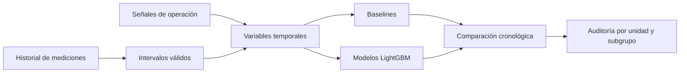

# Predicción de la próxima temperatura de baño

Proyecto **real** de machine learning aplicado a un proceso de electrólisis. El objetivo es estimar la próxima medición de temperatura de baño a partir de mediciones anteriores y señales de operación disponibles antes del objetivo.

Este repositorio publica el **código de investigación y evaluación** del proyecto. Los datos industriales, modelos entrenados, extractos, credenciales y componentes de conexión a planta no se distribuyen. Las métricas agregadas de esta página sí provienen de la evaluación real; no son una simulación.

## Problema y enfoque

La temperatura se mide de forma intermitente. Cada ejemplo une una medición inicial con la siguiente medición objetivo y resume la evolución anterior al objetivo. El desafío principal es evitar fuga temporal: ninguna variable puede incorporar información registrada en el intervalo de la medición futura o después de ella.



El trabajo pasó por una línea base de mediciones anteriores, modelos iniciales, variables de señales de cinco minutos y un resumen térmico por ventanas. El modelo final de esta etapa usa 868 variables; las ventanas excluyen el período objetivo. La selección se hizo en tres cortes temporales anteriores a julio de 2026.

## Resultados agregados

Referencia retrospectiva de julio de 2026, con 7.595 intervalos. El MAE expresa el error absoluto medio en °C.

| Método | MAE |
| --- | ---: |
| Promedio de las dos últimas mediciones | 6,719 °C |
| Modelo con resumen térmico, salida balanceada | 4,588 °C |

Julio ya estaba observado durante el desarrollo, por lo que estos valores **no constituyen una validación prospectiva independiente**. La mejora frente al baseline se calculó sobre la misma cohorte. Los datos y las predicciones individuales no están publicados.

## Código incluido

| Etapa | Archivos | Función |
| --- | --- | --- |
| Preparación inicial | `src/01_...` a `src/03_...` | Validación, intervalos y primeras variables |
| Referencias y modelos iniciales | `src/04_...` a `src/10_...` | Baselines, entrenamiento, evaluación y análisis de error |
| Señales de cinco minutos | `src/15_...` a `src/17_...` | Auditoría, agregación causal y modelo |
| Resumen térmico y auditoría final | `src/18_...` a `src/20_...` | Variables por ventanas, selección y verificación |

Los scripts conservan la lógica del proyecto real. La integración de extracción, el piloto operativo y otros experimentos internos no forman parte de esta publicación.

## Reproducibilidad y límites

El código se puede inspeccionar y compilar, pero **no se puede reentrenar ni reproducir las métricas públicas sin los datos privados**. `config/parametros.yaml` documenta rutas y cortes esperados; sus archivos de entrada no se incluyen. No se publican ejemplos fabricados como sustituto de la evidencia real.

Para preparar el entorno:

```bash
python -m venv .venv
# Windows: .venv\Scripts\activate
# Linux/macOS: source .venv/bin/activate
pip install -r requirements.txt
python -m compileall -q src
```

La estructura del flujo y las decisiones de validación se explican en [Metodología](docs/METODOLOGIA.md). Los scripts escriben sus salidas en `data/processed/`, `models/` y `outputs/`, carpetas excluidas de Git.

## Estado

Investigación retrospectiva y piloto industrial separados. El modelo no se presenta aquí como validado prospectivamente ni apto para usarse fuera de su contexto original.
